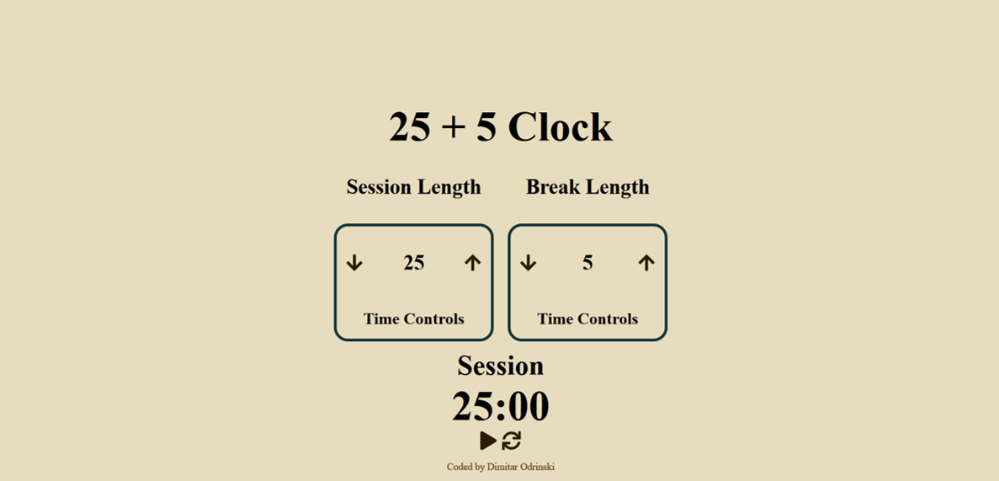
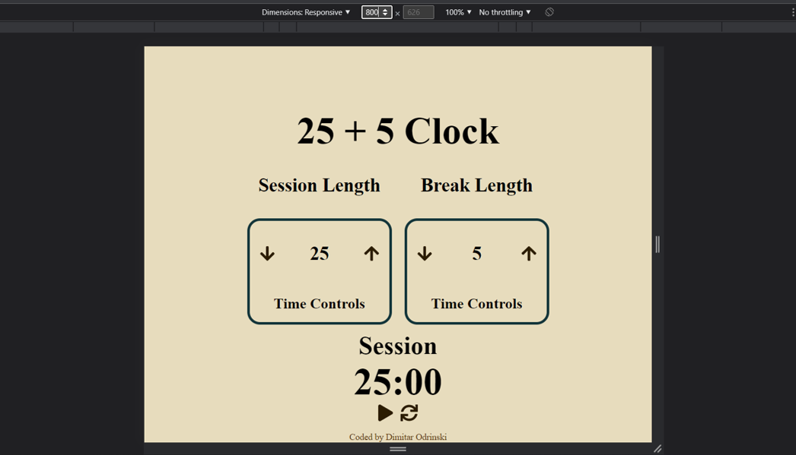
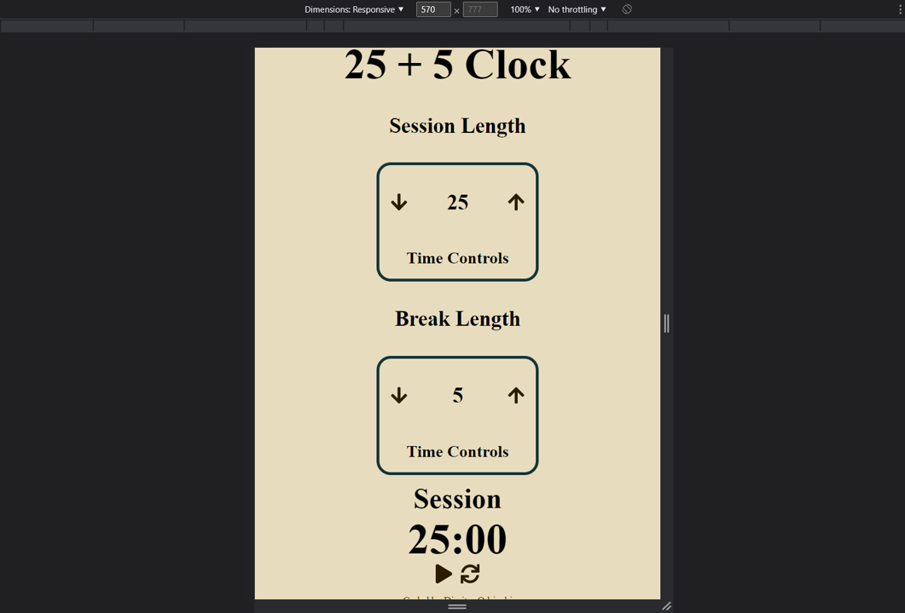
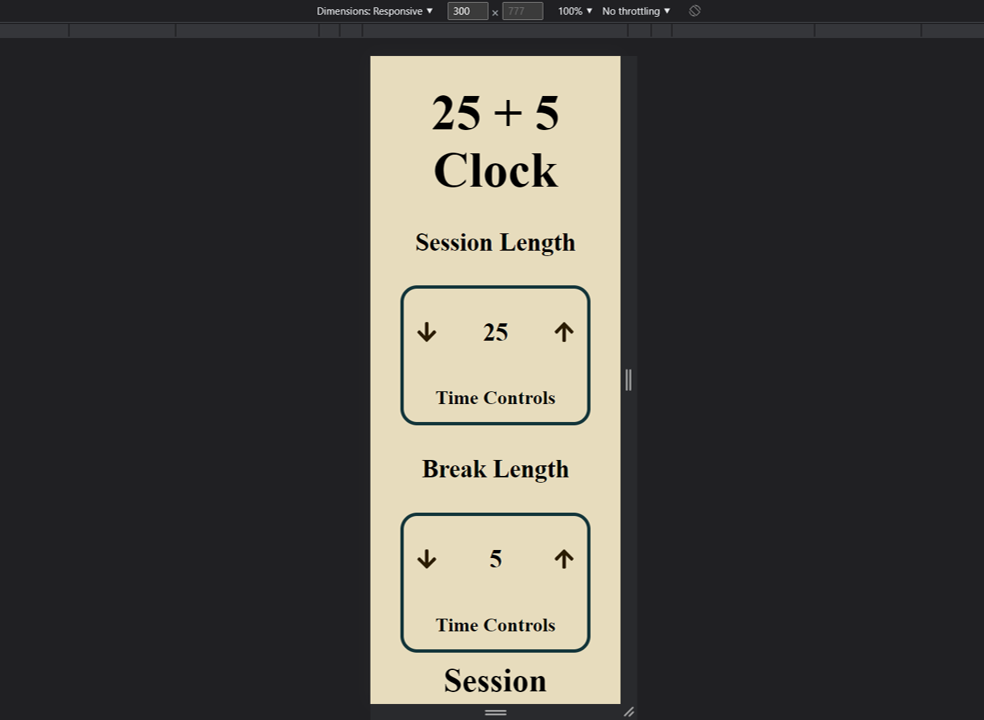

# Free Code Camp - Pomodoro Clock

# The challenge

Your challenge is to build out Pomodoro Clock.

Fulfill the user stories and get all of the tests to pass. Give it your own personal style.

You can use any mix of HTML, JavaScript, CSS, Bootstrap, SASS, React, Redux, and jQuery to complete this project. You should use a frontend framework (like React) because this section is about learning frontend frameworks. Additional technologies not listed above are not recommended and using them is at your own risk. Happy coding!

# My Solution

## Pomodoro Clock project has been realised with React class component and Font Awesome icons.

### Here are some previews of the project

## Desktop view - Fullscreen

## Tablet view - width 800px

## Mobile view - width 570px

## Mobile view - width 300px

